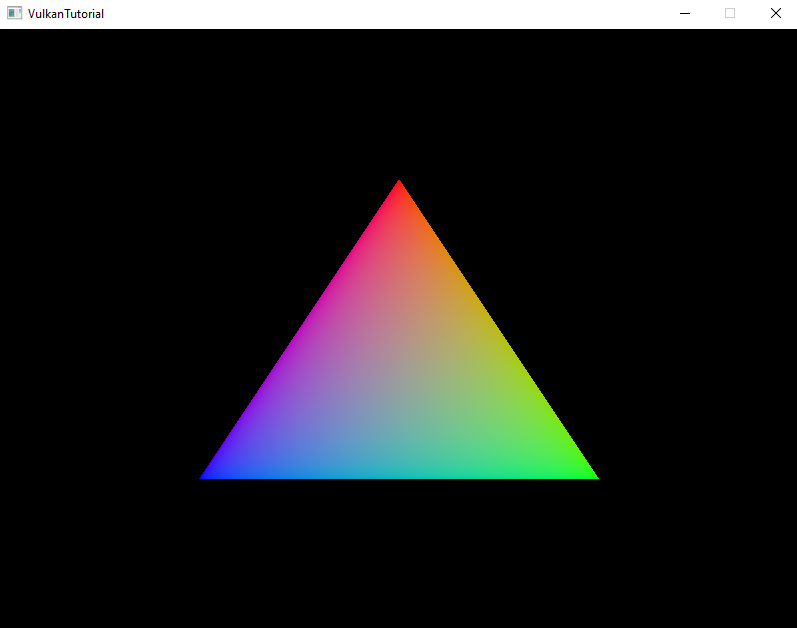

# Vulkan Triangle (WIP)

<a href="assets/triangle.png" target="_blank">
  
</a>


This is a simple project that demonstrates basic triangle rendering using the Vulkan graphics API.  
It serves as a starting point for learning and experimenting with Vulkan.

## 🔧 Project Status
This project is currently a **Work in Progress**.

## 📦 Dependencies

To build the project, you will need:

- [GLFW 3](https://www.glfw.org/) — for window and input handling  
- [Vulkan SDK](https://vulkan.lunarg.com/) — for Vulkan API development tools

## 🛠 Build Instructions

Clone this repository then open a terminal and run the following commands:

```bash
mkdir build
cd build
cmake ..
cmake --build .
```
